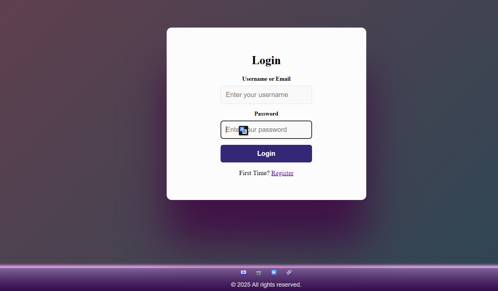
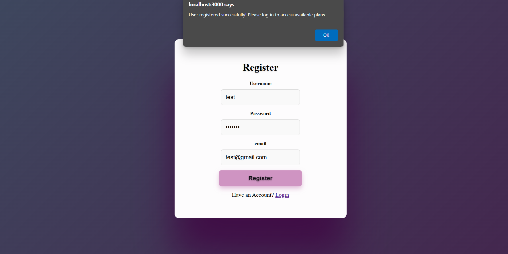
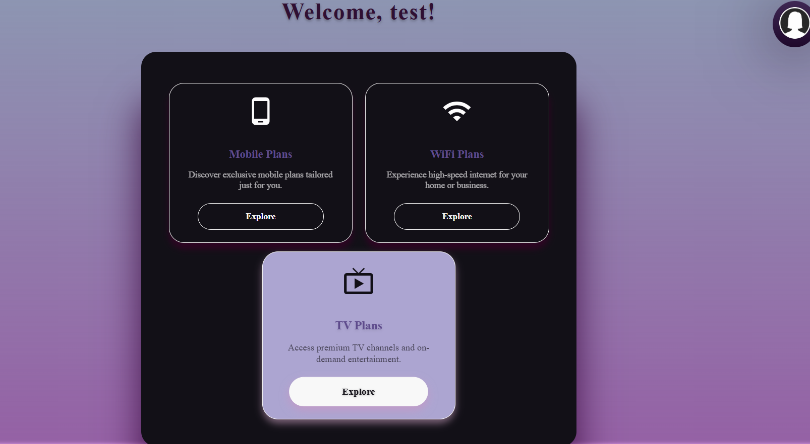
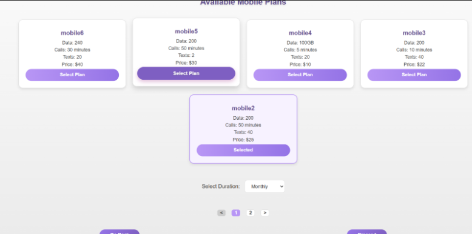
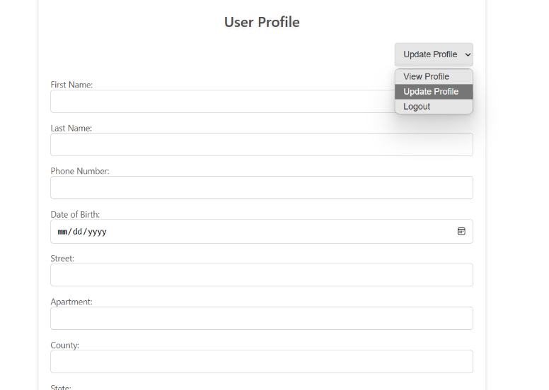
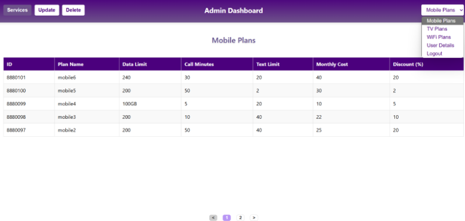
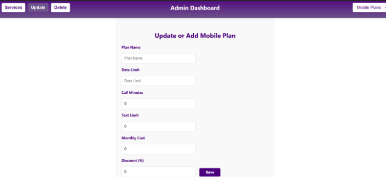
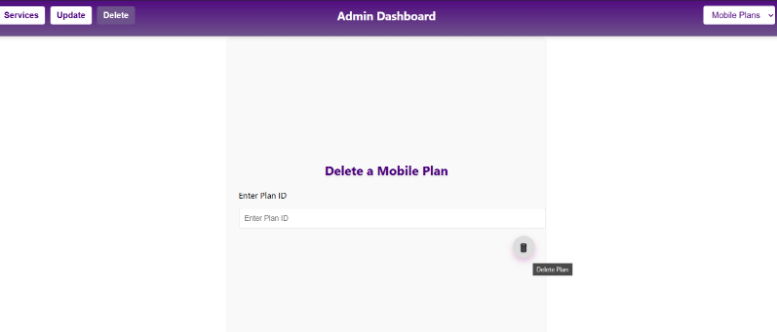
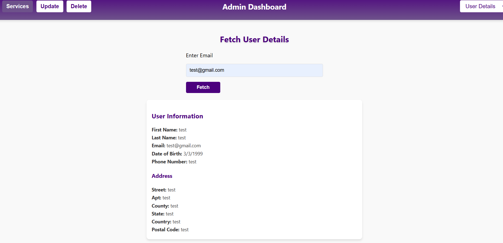

# 📦 Customer Subscription Management System

💼 Developed by **Ramya Kata** — Software Engineer

A full-stack subscription management platform designed to handle customer onboarding, plan selection, secure access, and subscription tracking. The app features **role-based dashboards** for Admin and Customers, with full authentication and microservice-based backend architecture.

---

## 🌟 Features

- 🎯 Secure Authentication and Authorization (JWT-based)
- 👥 Customer Registration and Management
- 📦 Plan Selection and Subscription Flow
-  📊 **Admin Dashboard** — accessible only with root credentials
- 📋 **Customer Dashboard** — users can view, select, and manage subscriptions
- 💳 Payment Gateway Integration (Dummy Payment Service)
- 🧠 Microservices Architecture using Spring Boot
- 🔎 Service Discovery using Eureka
- 🚪 API Gateway with centralized routing
- 🛠️ Frontend built with React.js 
- 📱 Fully mobile-responsive frontend


---

## 🔧 Tech Stack

### Backend
- Java 
- Spring Boot
- Spring Security
- Spring Cloud
- Eureka Server
- API Gateway (Spring Gateway)
- PostgreSQL
- MongoDB
- MySQL

### Frontend
- React.js 


---

## 📁 Project Structure


## Backend

- Developed multiple microservices: 
  - Authentication Service
  - Customer Service
  - Plan Service
  - Subscription Service
  - Payment Service
  - API Gateway
  - Service Registry
- Used Spring Boot, Spring Security, Spring Cloud, Eureka, etc.

## Frontend

- Built with [React.js] 
- Handles customer registration, plan selection, subscription management
- Communicates with backend via REST APIs

## 🧑‍💼 Roles & Access Flow

| Role     | Access Method     | Permissions                                                                                       |
|----------|------------------|----------------------------------------------------------------------------------------------------|
| **Admin**   | Login only (root credentials hardcoded) | Access to all customer data, plans, payments, and subscriptions          |
| **Customer** | Register → Login | View plans, subscribe/unsubscribe, view own subscriptions only                                 |


## How to Run

### Backend
1. Navigate to the backend service you want to run.
2. Use Maven to build and run:
   ```bash
   mvn clean install
   mvn spring-boot:run```

### Backend

1. Navigate to the frontend folder.

2. Install dependencies and start the frontend server:

	```bash
	   npm install
	   npm start```


 ## 📸 Screenshots

### 🔐 Login Page


### 📝 Register Page


### 🏠 Customer – Dashboard Overview


### 📱 Customer – Plan Selection


### 👤 Customer – Update Profile


### 🧾 Admin – View Mobile Plans


### 🛠️ Admin – Update Mobile Plan


### ❌ Admin – Delete Mobile Plan


### 🔍 Admin – Fetch User Info



## 💡 Developer Notes (Frontend)

- In this version, all API calls (using Axios) are written directly inside React components.
- This was done to speed up development and focus on functionality.
- In a production-grade application, I would:
  - Create a dedicated `services/` folder
  - Move all API calls into modular service functions
  - Set up a centralized `axios` instance with interceptors for authentication and error handling
